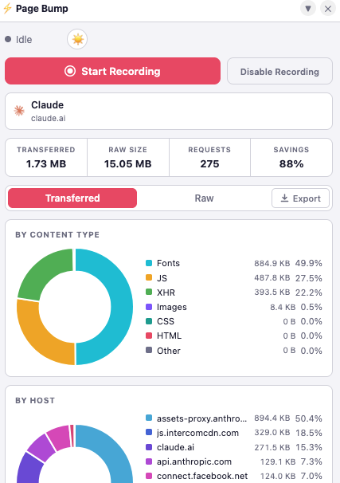

# Speed Bump

A lightweight Chrome extension that analyzes page weight by capturing network request sizes during page loads and visualizing them as interactive charts.



## Features

- **Automatic recording** — starts capturing on every page navigation, stops after 10 s or 1.5 s of network idle
- **Manual recording** — click Start Recording for a 20 s manual capture with no idle auto-stop
- **Floating overlay** — always-visible panel injected into every page; drag it anywhere on screen
- **Disable per tab** — pause recording on the current tab without affecting others
- **3 chart views:**
  - Doughnut by content type (HTML / CSS / JS / Images / Fonts / XHR / Other)
  - Doughnut by host (top 10, load more)
  - Horizontal bar by host + first path segment (top 10, load more)
- **Transferred vs Raw toggle** — switch between compressed (transferred) and uncompressed (raw) sizes
- **Compression savings** — shows how much bandwidth gzip/brotli saved
- **Page info card** — displays favicon, title, and URL of the recorded page
- **Light / Dark theme** — toggle with the ☀️/🌙 button; preference is saved
- **Position persistence** — panel position is remembered across page navigations

## How It Works

```
popup.js  ──sendMessage──►  background.js (service worker)  ──executeScript──►  page (MAIN world)
popup.js  ◄──response────   background.js
popup.js  ◄──broadcast───   background.js  (RECORDING_STOPPED, RECORDING_STARTED)
```

**Data sources:**
- `chrome.webRequest.onCompleted` → Content-Type header, Content-Length (transferred size proxy)
- `performance.getEntriesByType('resource')` via `executeScript` → `decodedBodySize` (raw), `transferSize` (accurate transferred)
- Both sources are merged by URL; CORS-restricted entries fall back to Content-Length

**Recording state machine:**
```
idle  ──(navigation / Start button)──►  recording  ──(10 s / 1.5 s idle / Stop)──►  collecting  ──►  idle
```

## Installation

1. Clone or download this repo
2. Open Chrome and go to `chrome://extensions`
3. Enable **Developer mode** (top-right toggle)
4. Click **Load unpacked** and select the `page_bump/` folder
5. Navigate to any page — the panel appears in the top-right corner

## File Structure

```
page_bump/
├── manifest.json              # MV3 extension manifest
├── rules.json                 # declarativeNetRequest rule: injects Timing-Allow-Origin header
├── background.js              # Service worker: recording state machine, data merge
├── content-perf-buffer.js    # Content script (document_start): expands perf timing buffer to 1000
├── content-overlay.js         # Content script: injects draggable iframe overlay
├── overlay.css                # Styles for the injected overlay container
├── popup.html                 # Panel UI layout
├── popup.css                  # Panel styles (dark/light theme)
├── popup.js                   # Panel controller: charts, state, controls
├── lib/
│   └── chart.min.js           # Chart.js 4.4.4 (local, no CDN)
└── icons/
    ├── icon16.png
    ├── icon48.png
    └── icon128.png
```

## Permissions Used

| Permission | Why |
|---|---|
| `webRequest` + `<all_urls>` | Capture response headers (Content-Type, Content-Length) for every request |
| `webNavigation` | Auto-start recording on page navigation |
| `scripting` | Run `performance.getEntriesByType()` in the page's MAIN world |
| `tabs` | Read tab URL, title, and favicon after recording |
| `storage` | Persist recording state, theme, overlay position |
| `alarms` | 10 s / 20 s max-duration timer that survives service worker sleep |
| `declarativeNetRequest` | Inject `Timing-Allow-Origin: *` into responses so the Performance API can report accurate sizes for cross-origin resources |

## Known Limitations

- SPA navigation (pushState/replaceState) is not detected — only full page loads trigger auto-recording
- Resources that are both CORS-restricted **and** served without a `Content-Length` header (chunked streaming with no `Timing-Allow-Origin`) will show 0 bytes — this is the only remaining unresolvable case
